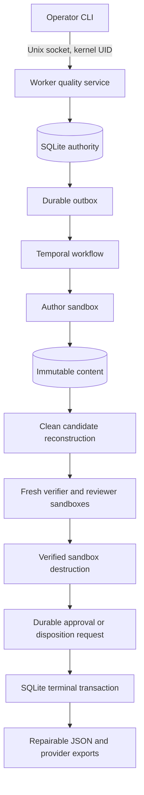

# ADR: authoritative patch assurance on the factory runtime

Status: accepted for controlled v1.

## Decision

Use the existing Temporal runtime for execution and recovery, with an assurance
domain package and a QMS policy pack. Keep SQLite as the single local authority
for admissions, policy versions, execution snapshots, candidate identity,
attempts, approvals, exceptions, non-conformances, CAPA, and final results.

The assurance subject is an exact binary patch against a preserved Git baseline.
An approved patch does not authorize a release. `ReleaseRequest` and
`ReleaseAuthorizer` define a separate future boundary; v1 has no release adapter.

## Authority and admission

Only the worker opens the private database and content directory. A Linux Unix
socket authenticates callers through `SO_PEERCRED`; server configuration binds
UIDs to roles. Actor strings and workflow signals do not authorize a decision.
The socket parent must be worker-owned and unwritable by other users. Host
administrators and the worker identity are trusted.

When QMS is enabled, every new source must resolve to the operator repository
registry. One request has exactly one source, consistent with its source kind.
Remote aliases are exact; local paths are canonicalized. A repository inherits
the union of policy bindings from its registered scopes. A caller cannot choose
a scope that removes this minimum.

An admission reserves the run ID, requester, request digest, random admission
identifier, expected workflow ID and frozen definitions before dispatch. The
outbox starts the workflow with duplicate workflow ID reuse rejected. The
workflow binds the Temporal execution ID once. Existing admissions use their
snapshot even when live configuration changes.

## Immutable definitions and candidates

Policy versions cannot be overwritten. Snapshots include effective command
profiles, harness and model definitions, workspace/egress resources, limits,
qualifications, classifier version and imported requirements. Host harness binary
and catalog contents are copied into content-addressed storage. Credential
values remain outside the snapshot; mutable provider session files are rejected.

Before authoring, preserve a Git bundle, baseline commit and tree identity.
Establish all configured author prerequisites, including prerequisites which
could become applicable after classification. The final patch is staged against
the original baseline, capturing agent commits and uncommitted additions.
Reconstruct from that bundle and patch in a new sandbox. Derive paths with
rename detection disabled so both removed and added names affect classification.

Object names are SHA-256 digests. Publication writes a private temporary file,
fsyncs it, creates a no-replace link, and fsyncs the directory. Reads verify size
and digest. A Git tree digest hashes the canonical recursive Git tree listing;
the preserved bundle and patch additionally bind the transported bytes.

## Verification and review

Every attempt receives a separate sandbox ownership slot. Verification uses
frozen commands. Reports supplied by repository tools remain distinguishable
from factory-collected process receipts. Evidence outputs cannot overlap
candidate source or impersonate reserved receipt types. Tool qualifications can
require an observed executable SHA-256 before and after execution.

Independent review uses a distinct configured harness and a fresh actor,
process/session and sandbox. Its structured report binds the candidate and plan
digests. The reviewer cannot update the canonical content store. Source changes
are detected and rejected, and are never imported. Cube's guest root execution
does not provide enforced read-only source isolation: policies requiring that
capability are rejected during configuration validation.

A completed failing result remains a failure. Only transient failures before
gate execution can receive another bounded infrastructure attempt. Uncertain
actor execution does not become a successful retry. A new candidate needs a new
run. Non-conformances retain original failures even after a permitted exception.

## Decisions and recovery

All execution sandboxes must be destroyed and their absence verified before a
human wait. Compute and human clocks are separate. A policy-permitted failed
gate opens a bounded disposition window; missing evidence and immutable
authority/integrity controls cannot be waived. When several policies require a
gate, exception permission must survive all of them.

SQLite serializes approval, rejection and expiry. Distinct eligible people fill
approval obligations; independent rules exclude the requester. Server time
determines eligibility. The first terminal request state wins. Notifications
are an outbox side effect and signals merely trigger another database read.

After immutable evidence is published, one database transaction stores the
decision, exact manifest, exact unsigned in-toto statement, audit event and
export outbox entries. This is completion. Retries return those exact bytes.
An export error cannot change the decision or run gates again. The manifest
references the attestation digest; the attestation does not hash the manifest.

CAPA is a separate Temporal workflow following durable, authenticated state
transitions. Its effectiveness assessment binds approved acceptance criteria
and selected evidence from independently approved remediation runs. Independent
verification and authorized closure preserve the original failed execution.

## Compatibility and limits

`assurance-control-plane-v1` versions the workflow command sequence. Existing
histories follow the legacy implementation. New protected executions require
admission; old runs never receive implied quality approval. Plain deployments
with no QMS policy files preserve the legacy execution path.

V1 supports one Linux host with durable local SQLite, ordinary Git blobs,
executable modes, symlinks and binary patches. Submodules, Git filters and LFS
materialization are rejected. Objects are limited to 256 MiB and frozen
execution snapshots to 1 MiB. Vendor adapters and cryptographic statement
signing remain future work. These limits fail admission or execution visibly.

## Verification

Tests cover risk composition, admission conflicts, source/scope bypass attempts,
peer identities, approval races and deadlines, immutable policy versions,
transaction rollback/restart, evidence corruption, exception preservation, CAPA
separation, real Git reconstruction, fresh reviewer execution, and cleanup.
The integration suite exercises R2/R3 through real CubeSandbox and Temporal and
replays histories using the same payload codec as the worker.
